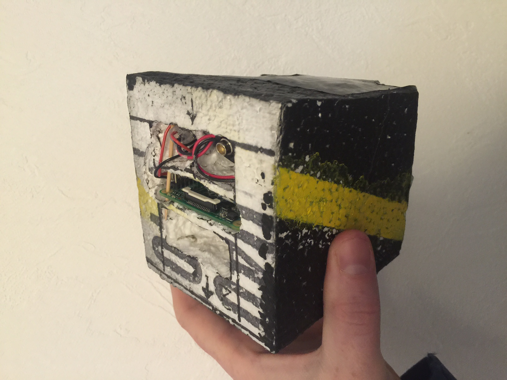

As you can see below the BOM (bill of materials) is divided into multiple lists so e.g. if you already have a parachute you can just skip that section. Also note that this BOM is for a special kind of balloon where the total mass of balloon, parachute, strings and payload must weigh less than 500 grams. In the United States of America it seems that you can launch a lot heavier items more easily. If you live there this BOM might not be for you. If you live in Europe (or more precisely Germany), the BOM might be of interest!

### Tools and materials
We custom built our own payload boxes that carry a GPS tracker, the Raspberry Pi camera, etc. a while back. With the items below you can build several of these boxes so you only need to buy these items once.

- Styrofoam (10 cm): 10 Euros
- Styrofoam (2 cm): 5 Euros
- Blow torch incl. 4 gas catridges: 20 Euros
- Hot glue gun: 10 Euros
- Duct tape: 5 Euros
- Carpet knife: 3 Euros
- Strong wire to heat and melt the styrofoam: 3 Euros
- Long, sharp knife (you won't be able to use it for anything else later on): 10 euros

*The picture above shows the finished payload box sans GPS tracker and battery. It was cut from 10cm styrofoam. The holes were melted using a blow torch and a wire.*

Of course, you can also just take an off-the-shelf styrofoam box! For us however it turned out lighter than anything we could find, more resiliant against the cold and the Raspberry Pi slides just in so you don't need to attach it. 

Total cost of tools and materials needed: **approx. 66 Euros**

### Payload
This list consists of (almost) all items put into the payload box. I highly recommend buying all of the items on this list twice! If something doesn't work as expected or simply doesn't turn on just switch it!

- Prepaid SIM card: 10 Euros
- GPS tracker: 35 Euros
- Raspberry Pi Model A+: 23 Euros
- Raspberry Pi Camera: 23: Euros
- Pololu 5V DC-DC Step-up/-down converter (i.e. model S7V7F5): 5 Euros
- 2x Additional Raspberry Pi camera cables (they break easily): 3 Euros
- 9V block battery clip (connects battery to converter to Pi): 3 Euros

This totals to 107 Euros. However, we really really recommend buying these materials at least twice so that you have back-up in case anythin doesn't work on launch day. Total with back-up **approx. 214 Euros**

### Parachute and Strings
In our case building our own parachute and finding the perfect strings to use was essential to save weight (we needed to stay below 500 grams to avoid more strict government regulations).

- 1m x 1.5m Rip-stop nylon (27g per square meter): 15 Euros
- 4mm eyelets (keeps strings from cutting into nylon): 7 Euros
- 300 meters of 0.58mm dyneema fishing line (100 lbs): 10 Euros

This totals to **32 Euros**

### Operating materials
This is the stuff you need to operate the Raspberry that records videos and the balloon that needs to rise. You will need at least 3 batteries to test and have backup (we recommend more).

- 2 cubic meters of helium (enough for 2 balloon starts or 1 really sloppy one): 100 Euros
- 3x Energizer Ultimate Lithium 9V block batteries (IMHO Energizers are the best batteries we have seen for this job): 25 Euros
- 2x 16 GB SD cards (we put together some [scripts](https://bitbucket.org/rnorff/yffzhab) for recording continuously): 20 Euros

Total cost: **145 Euros**

### Test equipment
You will need to test everything *A LOT*. The model B+ Raspberry Pi allows you to set up the SD cards that the model A+ will boot from and record it's videos to.

- Raspberry Pi Model B+ (allows reading the videos from the A+): approx. 32 Euros
- Cat 5 network cable: 3 Euros

This totals to **35 Euros**

### Grand total
If you don't have any of the materials above at home the grand total will bring you to: **492 Euros**. Additionally, getting a balloon to fly and recover it later on takes weeks/months and iterations of planning, building, testing and improving. 

If you were looking for a quick/cheap hobby this might not be the one for you. The total above also resembles the bare minimum that we have found. The less accurate you work the more expensive it gets. We are quite sure that some people can stay below the 500 Euros as well, but for most people this is what to expect.