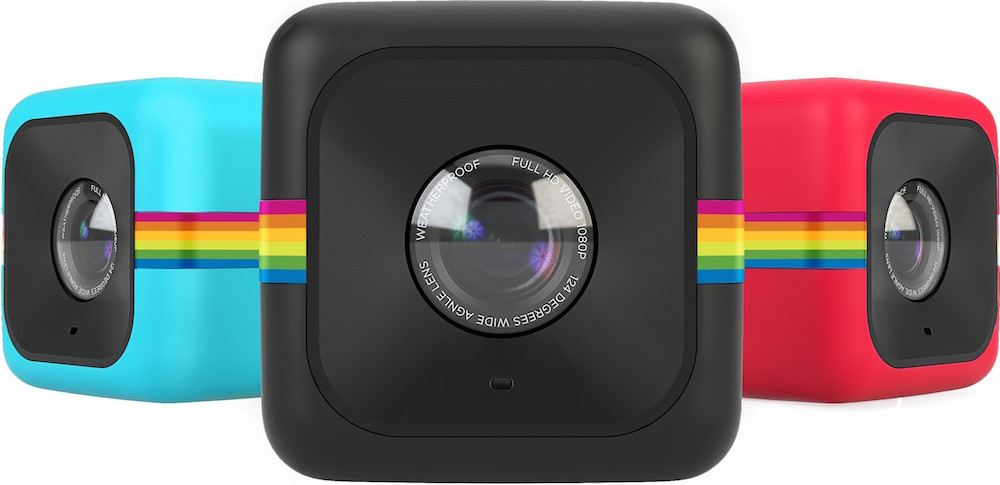
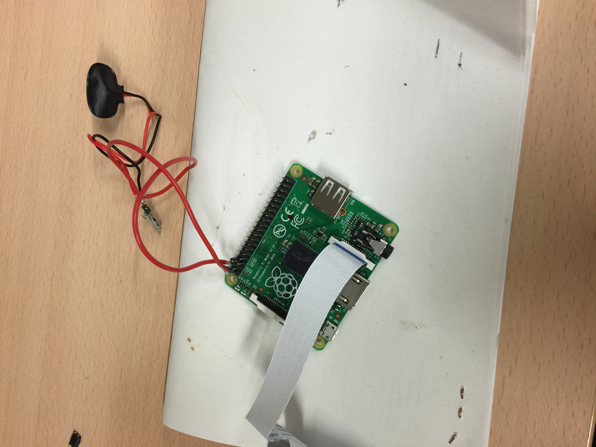

Obviously, most people who build the payload for their high altitude balloons will want to put a camera into the box. Nothing is as exciting as seeing our planet from an altitude where most of us will - most likely - never be able to go in their lives.

# Research
Before we went down the path of building our own we researched some available cameras. The GoPro comes to mind, but it is way too heavy for our purposes as there is a limit of 500 grams that the train consisting of balloon, parachute and payload is allowed to weigh in Germany (of course you can do more, but that would require additional permits and they are tough to get). So, in total we have a limit of about 150 grams that our payload should weigh. Reduce that by another 70 grams for tracking-equipment so we can find the balloon again later on (I will write something about that as well in the near future).

Next, we looked at the [Polaroid Cube](https://www.polaroidcube.com). It's a really neat, light-weight camera and reviews say the video quality is more than okay, but the battery only lasts 90 minutes. Our projected flight time is around 130 minutes and we want to make sure that we get the whole video. Also, be aware that batteries lose a certain amount of voltage in the cold. So the 90 minutes might become a lot less up there. So although a really cool product we had to keep on looking.

The other cameras we saw had limited recording time due to small batteries, used Lithium-Ion batteries which are not a really good choice in the cold (check back this blog in a couple of weeks where we will talk about powering electronics in cold environments). 

Then, the day the Raspberry Pi Model A+ was announced I went through the specs and it struck me. Why not use the Pi as a camera? The board weighs in at just 23 grams, the camera weighs another 3-4 grams and at 230mA recording FullHD-video it doesn't consume much power. Check out [Raspberry Pi A+ How Much Power Does It Need?](http://raspi.tv/2014/raspberry-pi-a-how-much-power-does-it-need) by RasPi.TV. They did some awesome power measurements just when we needed them :).

## Recording Video with the Pi

The Raspberry Pi lets you record videos from the command line easily. The command that lets you do that is called "raspivid". For the full set of arguments this command takes, head over to the [official Raspberry Pi Camera Module documentation](http://www.raspberrypi.org/documentation/raspbian/applications/camera.md) and go to the section "raspivid".

### A script for your convenience
We have written a init.d-script which blinks the ACT-LED for 3 seconds 3 times in a row to show the script has started. It then runs 3 test recordings of 5 seconds each, if succesful it lights the LED for 15 seconds. So for the 3 recordings you should see the LED flashing 15 seconds 3 times in a row. It then proceeds and starts recording the real video (in 720p to save battery-life) for 140 minutes after which it will finally shutdown. This should be enough to record the whole flight. If you are asking yourself why we slice the video: we thought if the Pi shuts down unexpectedly only having one large video file would give us a lot of trouble. Saving the video in smaller chunks allows us to recover all recordings up to that certain moment.

Below is the current version of the script:

The script starts automagically once you have followed the steps at the [YFFZHAB repository](https://bitbucket.org/rnorff/yffzhab). The script will start recording the videos immediately once rebooted and you can find the files in /home/pi/camera. If you want to save the files boot the Pi, ssh into it and kill the init.d process executing the script. Do this immediately if you read the videos from a Pi where there is no camera attached (I run the recording of the Pi on a model A+, but read the files from a B+) or the Pi will shutdown within 2 minutes.

	#!/bin/bash
	# /etc/init.d/yffzhabvideos

	### BEGIN INIT INFO
	# Provides:		yffzhabvideos
	# Required-Start:	$local_fs $syslog
	# Required-Stop:       	$local_fs $syslog
	# Default-Start:	2 3 4 5
	# Default-Stop:		0 1 6
	# Short-Description:	Takes videos for 130 minutes and shuts down.
	# Description:		Takes slices of videos of 130 minute length and then attempts to shutdown the Pi to not drain the battery 100%. The videos are saved to /home/pi/videos/inflight_*******.h264.
	### END INIT INFO

	case "$1" in
		start)
			# turn off HDMI (saves 20ma?): http://www.daveakerman.com/?page_id=1294
			/opt/vc/bin/tvservice -off

			mkdir /home/pi/camera

			# change ownership of OK-LED-file so we can access it
			echo none > /sys/class/leds/led0/trigger
			# blink OK-LED 3 times!
			ledCounter=3
			while [ $ledCounter -gt 0 ]
			do
				echo 1 > /sys/class/leds/led0/brightness
				sleep 3

				echo 0 > /sys/class/leds/led0/brightness
				sleep 1

				ledCounter=$(( $ledCounter - 1 ))
			done

			# test taking videos turning on an LED after success each time
			testCounter=3
			while [ $testCounter -gt 0 ]
			do
				echo "running test."
				raspivid -o /home/pi/camera/test_$testCounter.h264 -t 5000 --nopreview --vflip --hflip --width 1280 --height 720
				# blink status LED for 7 seconds here if successful!
				retCode=$?
				if [[ $retCode == 0 ]] ; then
					echo 1 > /sys/class/leds/led0/brightness
					sleep 15
					echo 0 > /sys/class/leds/led0/brightness
				fi

				testCounter=$(( $testCounter - 1 ))
			done
			# reset Raspberry's OK-LED to the SD Card
			echo 0 > /sys/class/leds/led0/brightness
			echo mmc0 > /sys/class/leds/led0/trigger

			rm -rf /home/pi/camera/test*

			# record the actual flight in 3 minute slices for a total time of 1h20m!
			echo "Recording video."
			raspivid -o /home/pi/camera/inflight_%04d.h264 --timeout 8400000  --nopreview --segment 180000 --vflip --hflip --width 1280 --height 720

			# times up. do a nice shutdown, but allow script to be killed before. E.g. to copy over recorded videos.
			echo "done recording. shutting down in 2 minutes. goodbye."
			sleep 120s
			shutdown -h now

			;;
		stop)
			killall yffzhabvideos
			;;
		*)
			echo "Usage: /etc/init.d/yffzhabvideos {start|stop}"
			;;
	esac

	exit 0

Let's look at the key line:

	raspivid -o /home/pi/camera/inflight_%04d.h264 --timeout 8400000  --nopreview --segment 180000 --vflip --hflip --width 1280 --height 720

This will output video files to /home/pi/camera/ and the files will be called inflight_XYZ.h264 (where XYZ is a number starting at 0). The video will stop after a --timeout of 8400000 milliseconds or 140 minutes. It will record in --segment(s) of 180000 milliseconds or 3 minutes. We flip the video with --hflip and --vflip because we accidentally embedded the camera upside down into the payload's box. Finally, we record in the dimensions 1280x720 pixels, so not in FullHD, to save some battery.

## Wrap up and recommendations
As you can see, it is really easy to use a Raspberry Pi as a near-space camera. If it is practical we will learn on our first flight. If you want to try this too, we really recommend using a B+ for testing and reading the videos on the ground and using the Model A+ inflight due to its lower weight and power consumption. They are a powerful couple! :)

## Next time
So this was it. Hope you like our solution for recording videos in the sky and check back soon. We will be talking about how to actually power the Pi up there. Small hint: it won't be via the USB cable.